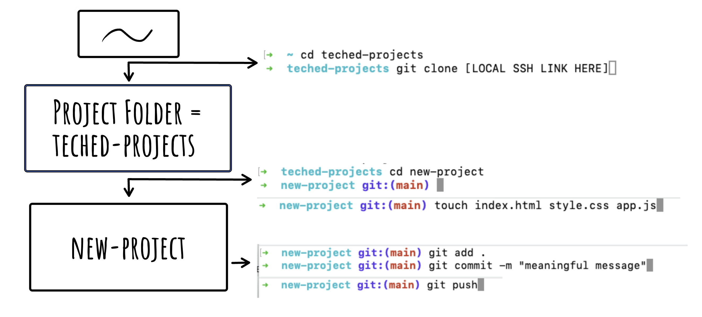
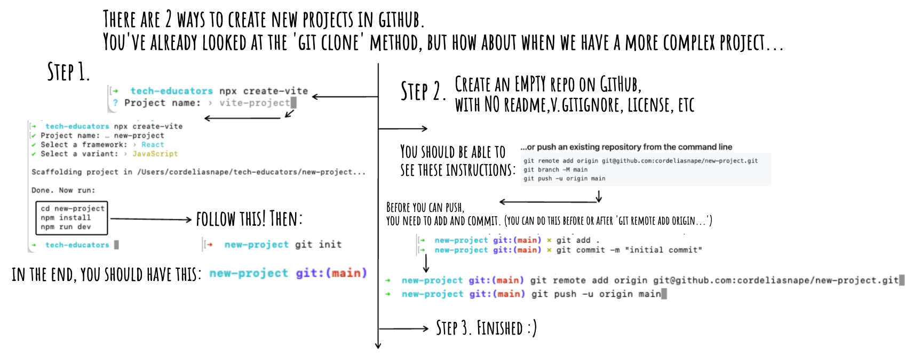

# Diagrams and Guides

### Setting up an Express Server

Remember to include
`app.use(express.json())`
after `const app = express()` in your server.js file

### Anatomy of a Route Handler

### Vanilla JavaScript - How to set up a project on GitHub

### Vite - How to set up a project on GitHub

