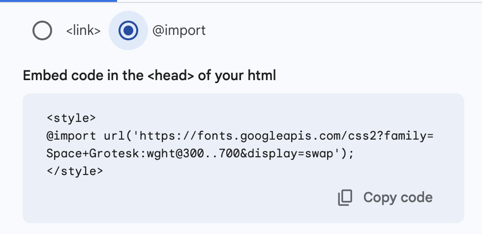

# Importing Fonts on Google

CSS has some pre-built fonts, all of which are separated into generic font families: serif, sans-serif, monospace, cursive and fantasy. These all come with a few fonts that are useful but perhaps a little too generic. What if we wanted to use a more interesting font in our website, for example, one from [Google fonts](https://fonts.google.com/).

## Guide

### Step 1: Find a Font

Go to [Google fonts](https://fonts.google.com/) and find a font you like. In this example, we are going to use 'Space Grotesk'. Click on the font you wish to use, then click 'Get font'. It will then be added to your 'selected families', which is similar to an online shopping basket. You can add multiple fonts in at this time if you want to.


Now, click on the selected families and then `<> Get embed code`. Then, selected `@import`.



Here, you'll see something like this, in between 2 `<style>` tags. Copy everything **in between** those 2 style tags:

```css
@import url("https://fonts.googleapis.com/css2?family=Space+Grotesk:wght@300..700&display=swap");
```

### Step 2: Importing the Font

Copy this `@import`, and then paste it into the top of the CSS file. Let's take a look at the URL, and then we will know what `font-family` value we need to use. In this case, we can see `?family=Space+Grotesk:`, so we know that the `font-family` value is `"Space Grotesk"`.

```css
p {
  font-family: "Space Grotesk";
}
```

Congrats, you've just imported a Google font into your CSS file!

### Customising Fonts

In the example case of `Space Grotesk`, there is a weight value of 300 - 700. This is how bold we can make the text. You can change how bold the text is using the `font-weight` property:

```css
p {
  font-family: "Space Grotesk";
  font-weight: 700;
}
```

There are also a bunch more fun things you can do with google fonts if those fonts are 'variable'. Feel free to experiment and have fun!
